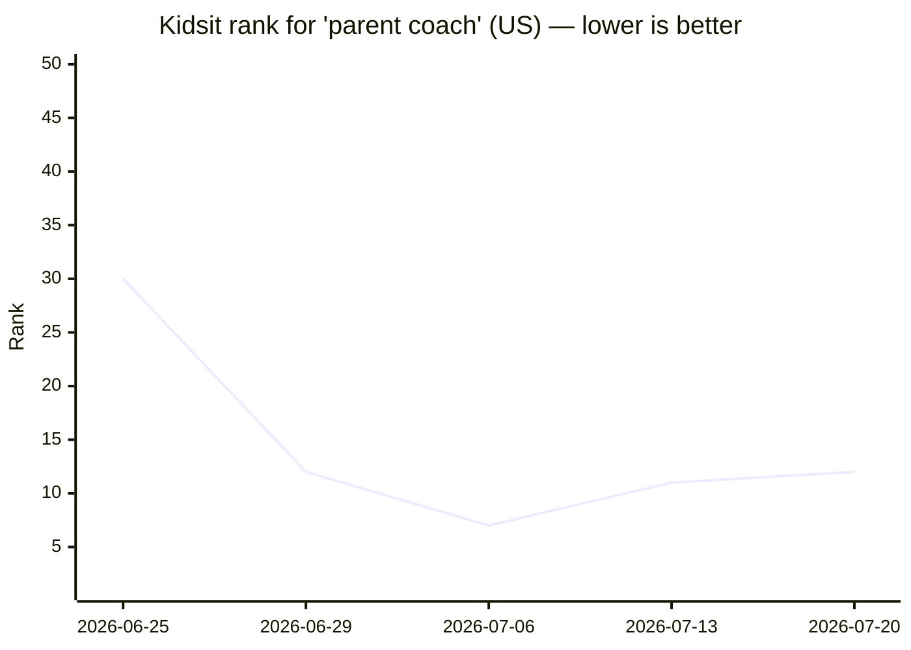

# Scout log — parent coach (US)

App: [Parent Coach AI: Kidsit](https://apps.apple.com/us/app/id6769443099) (id 6769443099)

Baseline 2026-06-25: Kidsit #30, difficulty 46.

<!-- chart-start -->

<!-- chart-end -->

## 2026-06-25
- Kidsit rank: #30 (Δ +0 vs baseline)
- Difficulty: 46 (MEDIUM) — baseline 46
- Median ratings top-10: 3
- Title hits top-10: 9/10
- Title indexed as: Kidsit AI - Parent Coach

## 2026-06-29
- Kidsit rank: #12 (Δ +18 vs baseline)
- Difficulty: 46 (MEDIUM) — baseline 46
- Median ratings top-10: 3
- Title hits top-10: 9/10
- Title indexed as: Parent Coach AI: Kidsit

## 2026-07-06
- Kidsit rank: #7 (Δ +23 vs baseline)
- Difficulty: 46 (MEDIUM) — baseline 46
- Median ratings top-10: 3
- Title hits top-10: 9/10
- Title indexed as: Parent Coach AI: Kidsit

## 2026-07-13
- Kidsit rank: #11 (Δ +19 vs baseline)
- Difficulty: 46 (MEDIUM) — baseline 46
- Median ratings top-10: 3
- Title hits top-10: 9/10
- Title indexed as: Parent Coach AI: Kidsit

## 2026-07-20
- Kidsit rank: #12 (Δ +18 vs baseline)
- Difficulty: 42 (MEDIUM) — baseline 46
- Median ratings top-10: 3
- Title hits top-10: 8/10
- Title indexed as: Parent Coach AI: Kidsit
