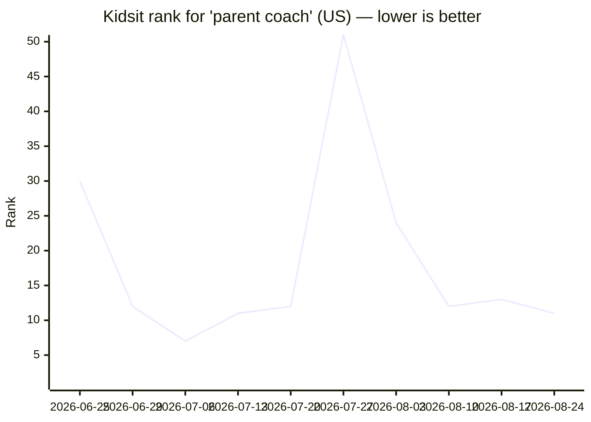

# Scout log — parent coach (US)

App: [Parent Coach AI: Kidsit](https://apps.apple.com/us/app/id6769443099) (id 6769443099)

Baseline 2026-06-25: Kidsit #30, difficulty 46.

<!-- chart-start -->

```mermaid
xychart-beta
    title "Kidsit rank for 'parent coach' (US) — lower is better"
    x-axis ["2026-06-25", "2026-06-29", "2026-07-06", "2026-07-13", "2026-07-20", "2026-07-27", "2026-08-03", "2026-08-10", "2026-08-17", "2026-08-24"]
    y-axis "Rank" 1 --> 50
    line [30, 12, 7, 11, 12, 51, 24, 12, 13, 11]
```
<!-- chart-end -->

## 2026-06-25
- Kidsit rank: #30 (Δ +0 vs baseline)
- Difficulty: 46 (MEDIUM) — baseline 46
- Median ratings top-10: 3
- Title hits top-10: 9/10
- Title indexed as: Kidsit AI - Parent Coach

## 2026-06-29
- Kidsit rank: #12 (Δ +18 vs baseline)
- Difficulty: 46 (MEDIUM) — baseline 46
- Median ratings top-10: 3
- Title hits top-10: 9/10
- Title indexed as: Parent Coach AI: Kidsit

## 2026-07-06
- Kidsit rank: #7 (Δ +23 vs baseline)
- Difficulty: 46 (MEDIUM) — baseline 46
- Median ratings top-10: 3
- Title hits top-10: 9/10
- Title indexed as: Parent Coach AI: Kidsit

## 2026-07-13
- Kidsit rank: #11 (Δ +19 vs baseline)
- Difficulty: 46 (MEDIUM) — baseline 46
- Median ratings top-10: 3
- Title hits top-10: 9/10
- Title indexed as: Parent Coach AI: Kidsit

## 2026-07-20
- Kidsit rank: #12 (Δ +18 vs baseline)
- Difficulty: 42 (MEDIUM) — baseline 46
- Median ratings top-10: 3
- Title hits top-10: 8/10
- Title indexed as: Parent Coach AI: Kidsit

## 2026-07-27
- Kidsit rank: NOT in top 50 (Δ n/a vs baseline)
- Difficulty: 45 (MEDIUM) — baseline 46
- Median ratings top-10: 2
- Title hits top-10: 9/10
- Title indexed as: n/a

## 2026-08-03
- Kidsit rank: #24 (Δ +6 vs baseline)
- Difficulty: 39 (MEDIUM) — baseline 46
- Median ratings top-10: 5
- Title hits top-10: 7/10
- Title indexed as: Parent Coach AI: Kidsit

## 2026-08-10
- Kidsit rank: #12 (Δ +18 vs baseline)
- Difficulty: 46 (MEDIUM) — baseline 46
- Median ratings top-10: 3
- Title hits top-10: 9/10
- Title indexed as: Parent Coach AI: Kidsit

## 2026-08-17
- Kidsit rank: #13 (Δ +17 vs baseline)
- Difficulty: 46 (MEDIUM) — baseline 46
- Median ratings top-10: 3
- Title hits top-10: 9/10
- Title indexed as: Parent Coach AI: Kidsit

## 2026-08-24
- Kidsit rank: #11 (Δ +19 vs baseline)
- Difficulty: 46 (MEDIUM) — baseline 46
- Median ratings top-10: 3
- Title hits top-10: 9/10
- Title indexed as: Parent Coach AI: Kidsit
